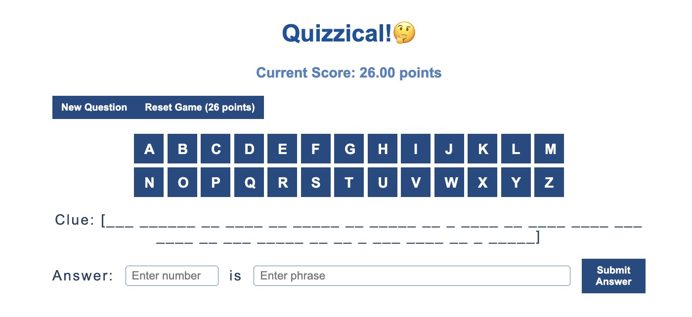

# Quizzical! Game
This is a single-player web application that combines a letter-guessing game with mathematical facts. Players must guess letters to reveal a hidden fact about a number, and then guess both the complete fact and the number it describes.




## Prerequisites
Before running this project, make sure the following have been installed:
- Node.js (v16.0.0 or higher)
- npm (Node Package Manager, usually comes with Node.js)


## Installation & Setup
1. Clone this repository:
```sh
git clone https://github.com/yileiCS/Game_Quizzical_WebApplication.git
```
2. Navigate to the project directory:
```sh
cd Game_Quizzical_WebApplication
```
3. Install the project dependencies:
```sh
npm install
```


## Running the Application
1. Start the development server:
```sh
npm run dev
```
2. Open your web browser and navigate to the URL shown in the terminal (typically `http://localhost:5173`)


## Building for Production
To create a production build:
```sh
npm run build
```

The built files will be in the `dist` directory.
To preview the production build locally:
```sh
npm run preview
```


## Game Instructions
1. **Starting the Game**
   - The game starts with 26 points
   - Letters are displayed as buttons at the top
   - A fact about a number is shown with letters hidden (underscores)
2. **Gameplay**
   - Click letter buttons to guess letters in the hidden fact
   - Correct guesses reveal all instances of that letter
   - Incorrect guesses reduce your score
   - Enter your guess for both the number and complete fact
   - Submit your answer when ready
3. **Scoring System**
   - Start with 26 points
   - Incorrect letter guesses reduce score based on number of wrong letters possible
   - Correct final answers add 4 points (max 30)
   - Partially correct answers (number or phrase only) halve current score
   - Completely incorrect answers result in 0 points
4. **Features**
   - Scoreboard tracking session scores
   - Sort scores by number, phrase, or score
   - Quiz mode to test memory of previous facts
   - Accessible design for visually impaired users


## Technical Details
- Built with Vue 3 Composition API
- Uses Vite as build tool
- Fetches data from Numbers API with local fallback
- Responsive design with CSS3
- Modular component structure
- Centralized state management with composables
- Service layer for API interactions
- Utility functions for game logic


## Troubleshooting
If you encounter any issues:
1. Make sure all dependencies are installed:
```bash
npm install
```
2. If you get "The service was stopped" error, delete node_modules and reinstall:
```bash
rm -rf node_modules package-lock.json
npm install
```
3. Clear npm cache if needed:
```bash
npm cache clean --force
```
4. Check if you're using the correct Node.js version:
```bash
node --version
```
5. If the Numbers API fails, the application will automatically fall back to local data
